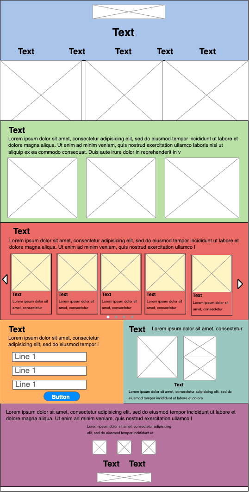

# My website: *The Secret Garden: Floral Studio* 

This website will showcase a floral studio,that will allow customers to learn .more about the studio, look at design and products as well as get in contact

## Structure:

### Navigation Menu:

It will have navigation menu - that includes an about, contact, flowers, and designs and prints, orders. A logo fo the studio will be placed just about the text.

### Pictures of Designs
There will be 2 rows showing pictures of recent floral designs.

### About Us:
This section will describe the studio, and what they do. It will also include a list of some of the magazines their arrangements have been featured in. 
Picture of some of these magzine designs will be featured. 

### Favourite Seasonal Flowers
This section will show the top flower picks for the season. 
There will be a short description of the section. Many pictures of the flowers will be shown underneath, with a short paragrach naming the flowers and it properties. Customers will be able to view all the flower cards by clicking through a horizontal scroll.

### Sign up to newsletter
This will include a form - that will allow the visitors to sign up to a newletter to become part of the secret garden community. It will ask for their full name, email and country, which visitors can then submit.
 
### Favourite designer or the week 
This will showcase a picture of a chosen designer - stating the designer name, and whether it is a someone from the studio or a guest. There will also be a couple pictures of their designs. There will be a short paragraph describing the designer and their choice in design underneath the picture. 

### Footer 
The footer will contain , a very short summary of the studio, as well as contact information - an email and phone number, as well as the address of the studio. 
It will also contain icons linking to their social media websites. 

It will also allow you to navigate to the the privacy policy and sustainability statemts. 
## Wiremap:
